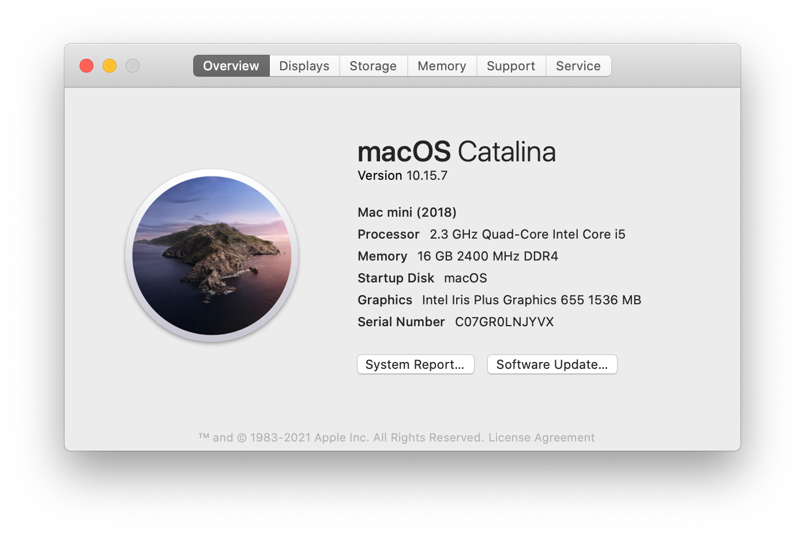

# NUC8i5beh Hackintosh（OpenCore）
`Updated on Sept. 11,　2023 by Yale Wei `



English | [简体中文](./README-zh_CN.md)  
[](https://github.com/longanw/nuc8i5beh) [](https://gitee.com/yalewei/nuc8i5beh)

Nuc8i5beh's EFI configs for hackintosh, It can be using Catalina and Monterey OS, for personality purpose.

#### Status：developing
[](https://ark.intel.com/content/www/cn/zh/ark/products/126148/intel-nuc-kit-nuc8i5beh.html?wapkw=nuc8i5beh) [](https://github.com/longanw/nuc8i5beh/releases) [](https://github.com/acidanthera/OpenCorePkg/releases/latest) [](https://github.com/OpenIntelWireless/itlwm/releases) [](https://www.apple.com/macos/catalina/) [](https://www.apple.com/macos/monterey/)[](https://www.apple.com/macos/ventura/)

#### Specs

| Name             | Information                            |
| ---------------- | ---------------------------------------|
| CPU              | Intel® Core™ i5-8259U                  |
| iGPU             | Intel Iris® Plus 655                   |
| Lan              | Intel I219-V                           |
| Audio            | Realtek ALC235                         |
| Ram              | Kingston 16GB*2 ddr4 2400 Mhz            |
| Wifi + Bluetooth | Intel® Wireless-AC 9560 + Bluetooth 5.0|
| Nvme             | INTEL 760P 512GB                       |
| SSD              | NONE                                   |
| Card Reader      | microSDXC Card Reader                  |
| SMBios           | MacMini8,1                             |
| BootLoader       | OpenCore 0.9.5                         |
| BIOS             | 092                                    |

#### Drivers

- [x] Intel Iris® Plus 655 iGPU HDMI/DP Output
- [x] ALC235 Internal Speakers
- [x] ALC235 HDMI/DP Audio Output
- [x] All USB Ports 
- [x] SpeedStep / Sleep / Wake
- [x] Intel® Ethernet Connection I219-V
- [x] Thunderbolt 3 port
- [x] Intel® Wireless-AC 9560 + Bluetooth 5.0
- [x] microSDXC Card Reader
- [x] NVRAM

#### BIOS
```
Devices -> USB -> Port Device Charging Mode: off
Devices -> USB -> USB Legacy -> Disabled
Devices -> Video -> IGD Minlmum Memory  ->64MB
Devices -> Video -> Aperture Size  ->256MB
Devices -> Video -> Primary Video Port  -> HDMI
Devices -> Video -> Secondary Video Port -> None
Security -> Thunderbolt Security Level: Legacy Mode
Power -> Wake on LAN from S4/S5: Stay Off
Boot -> Boot Configuration -> Network Boot: Disable
Boot -> Secure Boot -> Disable
```
#### Issues
- There is no signals on the display sometimes When using TypeC-to-DP output. Just re-poweron the display, everything will be all right.

 
#### Tools

| Name | Git links | Main features |
| ---| --- | --- |
| GenSMBIOS| [link](https://github.com/corpnewt/GenSMBIOS) | Generator for MLB,SN & UUID |
| ssdtPRGen| [link](https://github.com/Piker-Alpha/ssdtPRGen.sh) | Script to create ssdt-pr.dsl for Apple Power Management Support |
| ProperTree| [link](https://github.com/corpnewt/ProperTree) | .plist files editor |
| MacInstaller| [link](https://github.com/longanw/nuc8i5beh/blob/master/tools/MacInstaller.zip) | Script to create a recovery USB or an installer online   |
| BT-LinkeySync| [link](https://github.com/digitalbirdo/BT-LinkkeySync) | Script to synchronize bluetooth link keys from macOS to windows |

#### Buy me a coffee

| WeChat Pay | Alipay | 
| ---| --- |
|  |  |

#### Credits

- [Apple](https://www.apple.com) 
- [Intel](https://ark.intel.com/content/www/cn/zh/ark/products/series/129705/intel-nuc-kit-with-8th-generation-intel-core-processors.html) 
- [Acidanthera](https://github.com/acidanthera)
- [Rehabman](https://github.com/RehabMan) 
- [daliansky](https://github.com/daliansky) 
- [zxystd](https://github.com/OpenIntelWireless/itlwm)
- [zearp](https://github.com/zearp/Nucintosh) 
- [Dortania](https://dortania.github.io/OpenCore-Install-Guide/)
- [gitee.com](https://gitee.com) 
- [github.com](https://github.com) 


